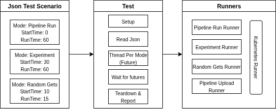

# KFP Performance Test Framework

This directory contains the KFP (Kubeflow Pipelines) Performance Test Framework, a comprehensive testing solution designed to evaluate the performance and scalability of Kubeflow Pipelines deployments.

## Overview

The performance test framework is built to run concurrent, configurable test scenarios against KFP deployments. It supports multiple test modes including pipeline execution, experiment management, and random GET operations. The framework uses JSON configuration files to define test scenarios and supports both single-user and multi-user (Kubeflow) modes.

## Architecture

The framework follows a modular, extensible architecture designed for concurrent test execution and comprehensive performance measurement.



### Core Components

```
perf-tests/
├── test_performance.py      # Main test entry point and orchestration
├── runners/                 # Test execution engines
│   ├── base_runner.py      # Abstract base class for all runners
│   └── pipeline_runner.py  # Pipeline-specific test runner
├── models/                  # Data models and schemas
│   └── test_scenario.py    # Test scenario data model
├── enums/                   # Enumeration definitions
│   └── test_mode.py        # Test mode enumerations
├── config/                  # Configuration management
│   ├── test_config.py      # Test configuration settings
│   └── logging_config.py   # Logging configuration
├── utils/                   # Utility functions
│   └── json_utils.py       # JSON deserialization utilities
├── serde/                   # Serialization/deserialization
│   └── enum_serde.py       # Enum serialization helpers
├── logger/                  # Logging infrastructure
│   └── logger.py           # Custom logging implementation
└── test_data/              # Test assets and configurations
    ├── scenarios/          # JSON test scenario files
    └── pipeline_files/     # Pipeline YAML definitions
```

### Architecture Overview

The framework operates on three main layers:

1. **Configuration Layer**: JSON-based test scenarios and environment configuration
2. **Execution Layer**: Concurrent test runners managed by thread pools
3. **Data Layer**: Structured logging, metrics collection, and result aggregation

## Test Scenario JSON Configuration

The framework uses JSON files to define test scenarios. These files specify the test parameters, timing, and execution behavior.

### JSON Schema

```json
[
  {
    "mode": "PIPELINE_RUN",
    "startTime": 0,
    "runTime": 5,
    "numTimes": 2,
    "pipelineFileName": "add_numbers.yaml"
  }
]
```

### Field Descriptions

| Field | Type | Description | Required |
|-------|------|-------------|----------|
| `mode` | string | Test execution mode (PIPELINE_RUN, EXPERIMENT, RANDOM_GETS, PIPELINE_UPLOAD, PIPELINE_SCHEDULED_RUN) | Yes |
| `startTime` | integer | Delay in minutes before starting the test (must be ≥ 0) | Yes |
| `runTime` | integer | Duration in minutes to run the test (must be > 0) | Yes |
| `numTimes` | integer | Number of pipeline runs to execute or number of pipelines to upload (must be > 0) | No* |
| `pipelineFileName` | string | Name of the pipeline YAML file to use | No* |
| `params` | object | Additional parameters for pipeline execution | No |
| `cron` | string | Cron expression for scheduled runs (required for PIPELINE_SCHEDULED_RUN) | No* |

*Required for most modes except RANDOM_GETS. See validation rules below.

### Test Modes

1. **PIPELINE_RUN**: Executes pipeline runs in the default experiment
2. **EXPERIMENT**: Creates a new experiment and runs pipelines within it
3. **RANDOM_GETS**: Performs random GET operations (not yet implemented)
4. **PIPELINE_UPLOAD**: Uploads multiple pipeline definitions
5. **PIPELINE_SCHEDULED_RUN**: Creates scheduled pipeline runs using cron expressions

### Validation Rules

The framework automatically validates test scenarios based on the following rules:

#### General Validation
- `startTime` must be non-negative (≥ 0)
- `runTime` must be positive (> 0)
- `numTimes` must be positive (> 0) when specified

#### Mode-Specific Requirements
- **PIPELINE_RUN**: Requires `pipelineFileName` and `numTimes`
- **EXPERIMENT**: Requires `pipelineFileName` and `numTimes`
- **PIPELINE_UPLOAD**: Requires `pipelineFileName` and `numTimes`
- **PIPELINE_SCHEDULED_RUN**: Requires `pipelineFileName`, `numTimes`, and `cron`
- **RANDOM_GETS**: No additional requirements

#### Cron Expression Validation
When using `PIPELINE_SCHEDULED_RUN` mode, the `cron` field must follow standard cron format:
```
minute hour day month day_of_week
```
- minute: 0-59
- hour: 0-23
- day: 1-31
- month: 1-12
- day_of_week: 0-6 (Sunday = 0)

### Example Scenario Files

#### Smoke Test (`smoke.json`)
```json
[
  {
    "mode": "PIPELINE_RUN",
    "startTime": 0,
    "runTime": 5,
    "numTimes": 2,
    "pipelineFileName": "add_numbers.yaml"
  }
]
```

This scenario:
- Starts immediately (0 minute delay)
- Runs for 5 minutes
- Executes 2 pipeline runs
- Uses the `add_numbers.yaml` pipeline

#### Load Test (`load_test.json`)
```json
[
  {
    "mode": "PIPELINE_RUN",
    "startTime": 0,
    "runTime": 30,
    "numTimes": 10,
    "pipelineFileName": "complex_pipeline.yaml"
  },
  {
    "mode": "EXPERIMENT",
    "startTime": 5,
    "runTime": 25,
    "numTimes": 5,
    "pipelineFileName": "ml_training.yaml"
  }
]
```

This scenario demonstrates concurrent execution of multiple test types with staggered start times.

#### Scheduled Run Test (`scheduled_test.json`)
```json
[
  {
    "mode": "PIPELINE_SCHEDULED_RUN",
    "startTime": 0,
    "runTime": 60,
    "numTimes": 3,
    "pipelineFileName": "data_processing.yaml",
    "cron": "0 */2 * * *"
  }
]
```

This scenario:
- Starts immediately (0 minute delay)
- Runs for 60 minutes
- Creates 3 scheduled pipeline runs
- Uses the `data_processing.yaml` pipeline
- Schedules runs every 2 hours using cron expression "0 */2 * * *"

## Runner Architecture

### Base Runner (`base_runner.py`)

The `BaseRunner` class provides the foundation for all test runners:

- **KFP Client Initialization**: Sets up connection to KFP API
- **Timing Management**: Handles test start/end timing
- **Abstract Methods**: Defines interface for `run()` and `stop()`

Key methods:
- `__init__(test_scenario)`: Initializes runner with test scenario
- `start()`: Waits for scheduled start time
- `run()`: Abstract method for test execution
- `stop()`: Abstract method for test termination

### Pipeline Runner (`pipeline_runner.py`)

The `PipelineRunner` extends `BaseRunner` to handle pipeline-specific testing:

- **Pipeline Upload**: Uploads pipeline definitions to KFP
- **Pipeline Execution**: Creates and monitors pipeline runs
- **Async Operations**: Uses asyncio for non-blocking operations
- **Metrics Collection**: Tracks execution times and performance data

Key methods:
- `upload_pipeline()`: Uploads pipeline YAML to KFP
- `run_pipeline(pipeline_id)`: Creates a new pipeline run
- `wait_for_run_to_finish(run_id)`: Monitors run completion
- `run_pipelines(num_of_runs)`: Manages multiple concurrent runs

## Data Models

### Test Scenario Model (`models/test_scenario.py`)

```python
class TestScenario(BaseModel):
    mode: EnumSerDe(TestMode).enum_by_name()
    pipeline_file: Optional[str] = Field(alias="pipelineFileName", default=None)
    num_times: Optional[int] = Field(alias="numTimes", default=1)
    start_time: int = Field(alias="startTime")
    run_time: int = Field(alias="runTime")
```

Uses Pydantic for:
- Data validation with custom model validators
- JSON deserialization
- Type safety
- Field aliasing (camelCase JSON to snake_case Python)
- Automatic validation of test mode requirements
- Cron expression format validation

## Configuration Management

### Test Configuration (`config/test_config.py`)

Environment-based configuration for:
- KFP API connection settings
- Namespace configuration
- SSL verification settings
- Cache enablement
- File paths and directories

Key environment variables:
- `API_HOST`: KFP API host (default: localhost)
- `API_PORT`: KFP API port (default: 8888)
- `NAMESPACE`: Kubernetes namespace (default: kubeflow)
- `SCENARIO_FILE_NAME`: Test scenario file name (default: smoke.json)

### Logging Configuration (`config/logging_config.py`)

Configures logging behavior including:
- Log levels
- File rotation settings
- Output formats
- Directory structure

## Utility Components

### JSON Utilities (`utils/json_utils.py`)

Provides JSON deserialization capabilities:
- `get_list_from_file()`: Loads JSON array from file
- `get_list_from_dictionary()`: Converts dictionary to model objects

### Enum Serialization (`serde/enum_serde.py`)

Handles enum serialization/deserialization:
- Converts string names to enum values
- Provides validation for enum values
- Supports JSON encoding/decoding

## Logging Infrastructure

### Custom Logger (`logger/logger.py`)

Advanced logging implementation with:
- **Color-coded console output**: Different colors for different log levels
- **File rotation**: Automatic log file rotation with size limits
- **Multiple handlers**: Console, file, and JSON handlers
- **Thread safety**: Safe for concurrent operations

Features:
- Rotating file handler with configurable size limits
- Color-coded console output for different log levels
- JSON format support for structured logging
- Automatic log directory creation

## Test Execution Flow

1. **Initialization**: Load test scenarios from JSON file
2. **Thread Pool Creation**: Create executor for concurrent test execution
3. **Runner Instantiation**: Create appropriate runner for each scenario
4. **Concurrent Execution**: Run all scenarios in parallel
5. **Monitoring**: Track execution progress and collect metrics
6. **Results Collection**: Gather performance metrics from all runners

### Execution Timeline

```
Time 0:    Scenario 1 starts (PIPELINE_RUN)
Time 5:    Scenario 2 starts (EXPERIMENT)
Time 10:   Scenario 1 completes
Time 30:   Scenario 2 completes
```

## Running Tests

### Prerequisites

1. KFP deployment accessible
2. Python 3.11.9 or higher
3. Required dependencies installed (see `pyproject.toml`)

### Environment Setup

```bash
# Set environment variables
export API_HOST=your-kfp-host
export API_PORT=8888
export NAMESPACE=kubeflow
export SCENARIO_FILE_NAME=your-scenario.json

# Install dependencies
pip install -e .
```

### Execution

```bash
# Run with pytest
pytest test_performance.py::TestPerformance::test_scenario -v

# Run with specific scenario file
SCENARIO_FILE_NAME=load_test.json pytest test_performance.py::TestPerformance::test_scenario -v

# Run with custom configuration
API_HOST=my-kfp-cluster API_PORT=443 pytest test_performance.py::TestPerformance::test_scenario -v
```

## Creating Custom Test Scenarios

1. **Define Pipeline**: Create pipeline YAML file in `test_data/pipeline_files/`
2. **Create Scenario**: Add JSON scenario to `test_data/scenarios/`
3. **Configure Parameters**: Set timing, concurrency, and execution parameters
4. **Run Test**: Execute with appropriate environment configuration

### Example Custom Scenario

```json
[
  {
    "mode": "EXPERIMENT",
    "startTime": 1,
    "runTime": 10,
    "numTimes": 5,
    "pipelineFileName": "ml_training_pipeline.yaml"
  },
  {
    "mode": "PIPELINE_RUN",
    "startTime": 2,
    "runTime": 8,
    "numTimes": 3,
    "pipelineFileName": "data_processing.yaml"
  }
]
```

## Performance Metrics

The framework collects various performance metrics:

- **Execution Times**: Time taken for each pipeline run
- **Concurrent Operations**: Number of simultaneous operations
- **Success/Failure Rates**: Test execution success metrics
- **Resource Utilization**: System resource usage during tests
- **Pipeline Upload Times**: Time to upload pipeline definitions
- **Run Creation Latency**: Time to create pipeline runs

### Metrics Collection

Metrics are collected at multiple levels:
- **Individual Run Level**: Per-pipeline execution metrics
- **Scenario Level**: Aggregated metrics per test scenario
- **Framework Level**: Overall test execution performance

## Extending the Framework

### Adding New Test Modes

1. Add new enum value to `TestMode`
2. Create new runner class extending `BaseRunner`
3. Implement `run()` and `stop()` methods
4. Update test execution logic in `test_performance.py`

### Adding New Metrics

1. Extend runner classes to collect additional metrics
2. Update `metricsToReturn` dictionary
3. Modify logging to capture new data points

### Example: Adding Custom Runner

```python
class CustomRunner(BaseRunner):
    def start(self):
        # Implement custom start logic if you want to override default start behavior
        pass
    def run(self):
        # Implement custom test logic
        pass
    
    def stop(self):
        # Implement cleanup logic
        pass
```

## Troubleshooting

### Common Issues

1. **Connection Errors**: Verify KFP API host/port configuration
2. **Namespace Issues**: Ensure correct namespace is set
3. **Pipeline Upload Failures**: Check pipeline YAML syntax
4. **Timing Issues**: Verify start/run time calculations
5. **Permission Errors**: Check KFP API access permissions

### Debug Mode

Enable debug logging by setting appropriate log level in configuration:

```python
# In logging_config.py
LOG_LEVEL = logging.DEBUG
```

### Performance Tuning

- **Concurrency**: Adjust thread pool size based on system resources
- **Timing**: Use staggered start times to avoid resource contention
- **Monitoring**: Monitor system resources during test execution

## Contributing

When contributing to the performance test framework:

1. Follow existing code structure and patterns
2. Add appropriate logging for new features
3. Update documentation for new functionality
4. Include test scenarios for new test modes
5. Ensure backward compatibility with existing configurations
6. Add comprehensive error handling
7. Include performance benchmarks for new features

### Development Guidelines

- Use type hints for all function parameters and return values
- Follow PEP 8 coding standards
- Add docstrings for all public methods
- Include unit tests for new functionality
- Update this README for any architectural changes

## Related Documentation

- [KFP SDK Documentation](https://kubeflow-pipelines.readthedocs.io/)
- [Performance Testing Best Practices](docs/performance-testing.md)
- [Architecture Decisions](docs/architecture-decisions.md) 