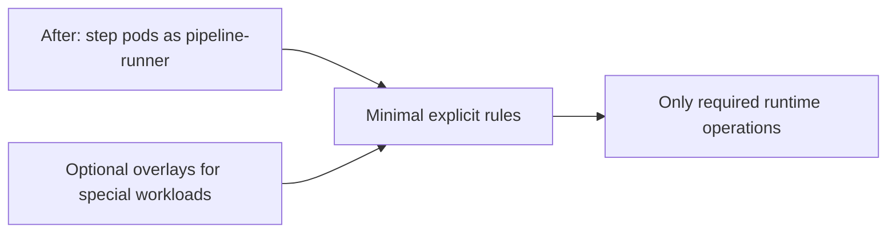
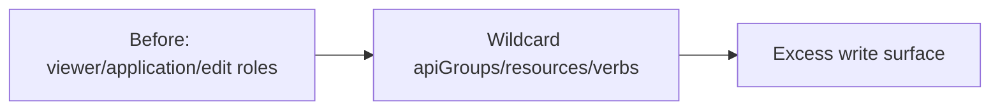
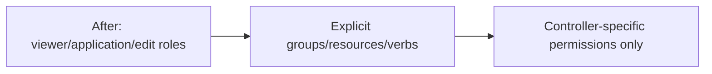
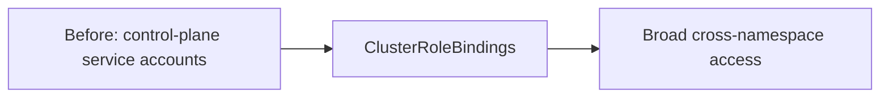
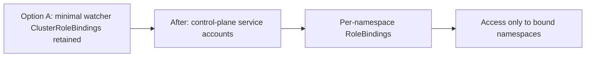
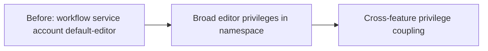
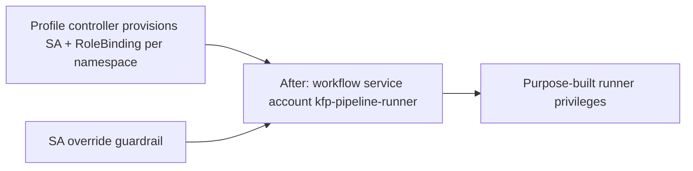

# KEP-13100: Least-Privilege Service Accounts for Kubeflow Pipelines

<!-- toc -->
- [Summary](#summary)
- [Motivation](#motivation)
  - [Current State and Security Risks](#current-state-and-security-risks)
  - [Goals](#goals)
  - [Non-Goals](#non-goals)
- [Proposal](#proposal)
  - [Phase 1: Eliminate Wildcard Permissions from Pipeline Runner](#phase-1-eliminate-wildcard-permissions-from-pipeline-runner)
  - [Phase 2: Separate Obsolete Components and Harden Remaining Roles](#phase-2-separate-obsolete-components-and-harden-remaining-roles)
  - [Phase 3: Scope Multi-User ClusterRoles to Managed Namespaces](#phase-3-scope-multi-user-clusterroles-to-managed-namespaces)
  - [Phase 4: Introduce Per-Namespace Service Accounts in Multi-User Mode](#phase-4-introduce-per-namespace-service-accounts-in-multi-user-mode)
  - [User Stories](#user-stories)
  - [Risks and Mitigations](#risks-and-mitigations)
- [Design Details](#design-details)
  - [Multi-User Architecture Background](#multi-user-architecture-background)
  - [Current RBAC Inventory and Audit](#current-rbac-inventory-and-audit)
  - [Cleanup Responsibility Separation](#cleanup-responsibility-separation)
  - [Driver/Launcher K8s API Call Audit](#driverlauncher-k8s-api-call-audit)
  - [Proposed Changes: Pipeline Runner (Phase 1)](#proposed-changes-pipeline-runner-phase-1)
  - [Proposed Changes: Separate and Harden Cache-Deployer and Cache Webhook Server (Phase 2)](#proposed-changes-separate-and-harden-cache-deployer-and-cache-webhook-server-phase-2)
  - [Proposed Changes: Remove Application Controller and Harden Viewer Controller (Phase 2)](#proposed-changes-remove-application-controller-and-harden-viewer-controller-phase-2)
  - [Proposed Changes: Multi-User ClusterRoles (Phase 3)](#proposed-changes-multi-user-clusterroles-phase-3)
  - [Proposed Changes: Per-Namespace Service Accounts (Phase 4)](#proposed-changes-per-namespace-service-accounts-phase-4)
  - [SDK, Backend, and Other Impact](#sdk-backend-and-other-impact)
  - [Backward Compatibility and Migration Strategy](#backward-compatibility-and-migration-strategy)
  - [Test Plan](#test-plan)
- [Implementation History](#implementation-history)
- [Drawbacks](#drawbacks)
- [Alternatives](#alternatives)
  - [Alternative 1: OPA/Gatekeeper Policy Enforcement](#alternative-1-opagatekeeper-policy-enforcement)
  - [Alternative 2: Maintain Status Quo with Documentation](#alternative-2-maintain-status-quo-with-documentation)
  - [Alternative 3: Full Namespace-Scoped Roles Only (No ClusterRoles)](#alternative-3-full-namespace-scoped-roles-only-no-clusterroles)
<!-- /toc -->

## Summary

Kubeflow Pipelines currently grants overly broad RBAC permissions to several service accounts, most critically `pipeline-runner` and `ml-pipeline-viewer-crd-service-account`. These service accounts use wildcard verbs (`*`) and wildcard resources (`*`) on multiple API groups, creating a significant attack surface. In multi-user mode, each control-plane service account is granted a ClusterRoleBinding to a ClusterRole. Because a ClusterRoleBinding grants permissions across all namespaces (unlike a RoleBinding, which confines a ClusterRole's rules to a single namespace), control-plane service accounts effectively have unrestricted cluster-wide access to resources like pods, workflows, and deployments. Additionally, the `application` controller and its overly-broad service account should be removed from KFP core — it is a GCP-specific integration component that is not needed in platform-agnostic deployments. The `kubeflow-pipelines-cache-deployer-sa` and its associated cache webhook infrastructure are only used by v1 pipelines; with KFP v2 handling caching entirely in the driver, these components should be separated into an optional v1-compatibility overlay, hardened where possible, and removed entirely in KFP v3 alongside v1 support.

This proposal introduces a phased approach to enforce the principle of least privilege across all KFP service accounts. The changes eliminate wildcards, scope permissions to the minimum required verbs and resources, remove or make optional components that are no longer needed in v2, introduce per-namespace service accounts for workload execution in multi-user mode, and harden third-party component roles. The goal is to reduce blast radius if any service account token is compromised, without breaking existing pipeline functionality.

## Motivation

### Current State and Security Risks

An audit of the KFP RBAC manifests reveals the following high-severity permission issues:

**1. `pipeline-runner` Service Account (Critical)**

This is the service account used by Argo Workflows to execute pipeline steps. Its current permissions include:

| API Group | Resources | Verbs | Risk |
|-----------|-----------|-------|------|
| `""` | pods, pods/exec, pods/log, services | `*` | Can exec into any pod in namespace, create arbitrary services |
| `""`, `apps`, `extensions` | deployments, replicasets | `*` | Can create/modify/delete any deployment |
| `""` | persistentvolumes, persistentvolumeclaims | `*` | Can mount any PV including those belonging to other workloads |
| `kubeflow.org` | `*` | `*` | Wildcard on all Kubeflow resources |
| `batch` | jobs | `*` | Can create/delete any batch job |
| `machinelearning.seldon.io` | seldondeployments | `*` | Full access to Seldon ML deployments |

A compromised pipeline step can use the `pipeline-runner` token to exec into other pods, create backdoor deployments, exfiltrate secrets, or escalate privilege by manipulating Kubeflow resources.

**2. `ml-pipeline-viewer-crd-service-account` (High)**

Reconciles Viewer CRDs into visualization Deployment/Service pairs. Uses wildcard API groups:

| API Group | Resources | Verbs |
|-----------|-----------|-------|
| `*` (all groups) | deployments, services | create, get, list, watch, update, patch, delete |

The `apiGroups: ['*']` means this service account can manage deployments and services across *every* API group, not just `apps` and core.

**3. `application` Manager Role — REMOVE FROM CORE**

| API Group | Resources | Verbs |
|-----------|-----------|-------|
| `*` | `*` | get, list, update, patch, watch |
| `app.k8s.io` | `*` | `*` |

Read+update access to every resource in every API group in the namespace. The application controller is a **GCP-specific component** used solely for Google Cloud Console integration. It is only deployed in `env/dev` and `env/gcp` environments — the controller image is hosted at `gcr.io/ml-pipeline/application-crd-controller`. Platform-agnostic, plain, and multi-user environments do not deploy the controller. This component should be removed from KFP core manifests and maintained by users who need GCP Console integration in their own deployment overlays.

**4. Multi-User ClusterRoleBindings (Medium-High)**

In multi-user mode, each control-plane service account is given a ClusterRoleBinding to its ClusterRole. Because a ClusterRoleBinding grants the ClusterRole's permissions across all namespaces — not just KFP-managed ones — `ml-pipeline` can create/delete Argo Workflows and `ml-pipeline-scheduledworkflow` can create events in *any* namespace, not just user namespaces managed by Kubeflow. (A RoleBinding referencing the same ClusterRole would confine access to a single namespace, which is the approach proposed in Phase 3.)

**5. `kubeflow-pipelines-cache-deployer-sa` ClusterRole — HARDEN AND SEPARATE (v1-only, obsolete in v2)**

| API Group | Resources | Verbs |
|-----------|-----------|-------|
| `certificates.k8s.io` | certificatesigningrequests, certificatesigningrequests/approval | create, delete, get, update |
| `certificates.k8s.io` | signers (`kubernetes.io/*`) | approve |
| `admissionregistration.k8s.io` | mutatingwebhookconfigurations | create, delete, get, list, patch |

The cache-deployer has cluster-wide CSR approval authority for **all** `kubernetes.io/*` signers and can create/delete MutatingWebhookConfigurations. This is a one-time bootstrap task (generates TLS certs for the cache webhook), yet the pod runs permanently (`sleep infinity`), leaving these elevated cluster-scoped permissions active indefinitely. The entire cache webhook infrastructure is only used by v1 pipelines — the v2 driver handles caching via gRPC to the KFP API server (`backend/src/v2/cacheutils/cache.go`), and the cache webhook explicitly skips v2 pods (`backend/src/cache/server/mutation.go:97`). The cache-deployer and webhook server should be moved into an optional v1-compatibility overlay, hardened (e.g., scope CSR signer names, consider `cert-manager` for TLS bootstrap), and removed entirely in KFP v3.

**6. `aggregate-to-kubeflow-pipelines-edit` ClusterRole (Medium)**

Grants `*` verbs on all Argo Workflow resources (workflows, cronworkflows, workflowtemplates, workfloweventbindings, workflowtaskresults) and all ScheduledWorkflow resources to any user with the `kubeflow-edit` role.

**7. `default-editor` in Multi-User Mode (High)**

In multi-user mode, pipeline step pods run as `default-editor`, which has full Kubeflow editor permissions — broader than needed for pipeline step runtime. Phase 4 replaces this with a purpose-built `kfp-pipeline-runner` SA.

### Goals

1. **Eliminate wildcard (`*`) verbs and resources by default** from KFP-managed RBAC roles, replacing them with the minimum required explicit permissions. Any temporary exception must be explicitly documented with owner and sunset criteria.
2. **Reduce `pipeline-runner` permissions** to only what the KFP driver/launcher and user containers actually need (remove `pods/exec`, restrict deployment access, scope PV/PVC to create/get/delete only).
3. **Scope multi-user ClusterRoles** so control-plane service accounts can only operate on namespaces labeled for KFP use (`pipelines.kubeflow.org/enabled: "true"`).
4. **Introduce per-namespace workload service accounts** in multi-user mode so that pipeline steps in one namespace cannot access resources in another namespace.
5. **Harden viewer controller and third-party roles** to use specific API groups instead of wildcards.
6. **Remove the Seldon deployment wildcard** from the default `pipeline-runner` role and make it an opt-in kustomize overlay.
7. **Provide an opt-in "legacy-permissive" overlay** for users who need the current broad permissions during migration.

### Non-Goals

- Changing the authentication or authorization flows (kubeflow-userid headers, TokenReview, SubjectAccessReview).
- Changing the pipeline execution engine (Argo Workflows) or the SDK's pipeline authoring surface.
- Introducing a new policy engine (OPA/Gatekeeper) as a hard requirement.

## Proposal

The proposal is structured in four phases that can be implemented and rolled out incrementally.

### Phase 1: Eliminate Wildcard Permissions from Pipeline Runner

**Impact: High security improvement in single-user mode, limited direct impact in multi-user mode until aggregated multi-user roles are tightened; Low risk**

Replace all wildcard verbs in `pipeline-runner-role.yaml` with explicit verb lists. Remove `pods/exec` (not needed by KFP driver/launcher). Restrict PV/PVC to needed verbs. Remove the Seldon deployment rule from the default role and move it to a kustomize overlay. Refactor the driver to read `KFP_POD_UID` from the downward API environment variable instead of calling `Pods.Get()`, eliminating the `pods/get` permission entirely.

The `pipeline-runner` service account is the most critical to harden because it is the service account used by *every pipeline step* pod. A malicious or compromised container image in a pipeline step inherits these permissions.

**Current workflow (before change):**


**Proposed workflow (after change):**



### Phase 2: Separate Obsolete Components and Harden Remaining Roles

**Impact: High security improvement, Low-Medium risk**

This phase delivers quick security wins by separating v1-only components from the default deployment, removing GCP-specific components from core, and hardening remaining roles. V1-only components are moved to optional overlays and hardened rather than deleted outright; full removal is deferred to KFP v3 alongside v1 support.

- **Remove the `application` controller, service account, role, rolebinding, and deployment** from KFP core manifests (`manifests/kustomize/third-party/application/`). This is a GCP-specific component that should be defined by users who need it in their own deployment overlays.
- **Move the cache-deployer and cache webhook server** into an optional v1-compatibility overlay, excluded from the default deployment. Harden the cache-deployer ClusterRole where fixes are low-risk (e.g., scope CSR signer names from `kubernetes.io/*` to the specific signer used). As a further hardening option, refactor TLS bootstrap to use `cert-manager` instead of the custom deployer. Full removal deferred to KFP v3.
- Replace `apiGroups: ['*']` with `['apps', '']` in the viewer controller role.
- Scope the `aggregate-to-kubeflow-pipelines-edit` ClusterRole to use explicit verbs instead of `*` on Argo and ScheduledWorkflow resources.

**Current workflow (before change):**



**Proposed workflow (after change):**



### Phase 3: Scope Multi-User ClusterRoles to Managed Namespaces

**Impact: Medium security improvement, Medium risk**

Instead of granting ClusterRoles with unrestricted namespace access via ClusterRoleBindings, confine write-path access to KFP-managed namespaces. The existing `sync.py` / profile-controller pattern already watches namespaces labeled `pipelines.kubeflow.org/enabled: "true"` and provisions per-namespace resources (ConfigMaps, Secrets, artifact proxy Deployments). This phase extends that same pattern to include per-namespace RoleBindings for control-plane service accounts, replacing their ClusterRoleBindings for write operations.

**Current workflow (before change):**



**Proposed workflow (after change):**



### Phase 4: Introduce Per-Namespace Service Accounts in Multi-User Mode

**Impact: High security improvement, High complexity**

This phase extends the same `sync.py` / profile-controller pattern used in Phase 3. In addition to the per-namespace RoleBindings for control-plane service accounts, `sync.py` will provision a per-namespace `kfp-pipeline-runner` ServiceAccount and RoleBinding. This replaces the overly-broad `default-editor` service account with a purpose-built account that has only the pipeline runner permissions needed within its own namespace.

**Current workflow (before change):**



**Proposed workflow (after change):**



### User Stories

#### Story 1: Cluster Administrator Hardening a Shared Cluster

As a cluster administrator running KFP in multi-user mode for multiple teams, I want to ensure that a compromised pipeline step in Team A's namespace cannot read secrets, exec into pods, or create deployments in Team B's namespace. With the current `pipeline-runner` ClusterRole, this is possible. After this proposal, each namespace gets its own scoped service account.

#### Story 2: Security Auditor Reviewing KFP Deployment

As a security auditor, I want to review KFP's RBAC configuration and see explicit, minimal permissions for each service account. Currently, I see `*` wildcards on critical resources, which fails most compliance frameworks (CIS Kubernetes Benchmark, SOC2, NIST). After this proposal, all roles use explicit verbs and resources.

#### Story 3: Platform Engineer Adding Custom Workload Types

As a platform engineer, I want to add support for Seldon or other ML serving frameworks without granting those permissions to all pipeline steps by default. After this proposal, I can add a kustomize overlay for Seldon permissions only in namespaces that need it.

### Risks and Mitigations

| Risk | Mitigation |
|------|------------|
| Breaking existing pipelines that rely on broad permissions (e.g., pipelines that create deployments, exec into pods) | Provide a `legacy-permissive` kustomize overlay with the original permissions. Document migration path. |
| Per-namespace service account provisioning adds latency to namespace creation | Profile controller already creates 5+ resources per namespace. One more ServiceAccount + RoleBinding is minimal overhead. |
| Some users rely on `kubeflow.org/*` wildcard for custom Kubeflow operators (e.g., TFJob, PyTorchJob) | Provide explicit rules for known Kubeflow operators (TFJob, PyTorchJob, MPIJob) and an overlay for custom operators. |
| ClusterRole scoping via namespace labels is not natively supported by Kubernetes RBAC | Use per-namespace RoleBindings created by the profile controller instead of a single ClusterRoleBinding. |

### Phase Deliverability and Definition of Done

Each phase is independently releasable only when it satisfies all of the following for that phase:

1. **Manifest/API deliverables are complete** for that phase only (no hidden dependency on a later phase).
2. **Positive and negative tests pass** for that phase in CI.
3. **Rollback path is documented and verified** in staging.
4. **Security acceptance criteria are met** for the specific threat being reduced by that phase.

**Phase 1 DoD**:
- Driver refactored to read `KFP_POD_UID` from downward API env var instead of `Pods.Get()`.
- Tightened `pipeline-runner` role merged (no `pods/get` needed after driver refactor).
- `pipeline-runner-legacy-permissive.yaml` overlay available and tested.
- Single-user E2E includes one negative authorization test (403) and PVC lifecycle regression test.
- Rollback: enable legacy-permissive overlay.

**Phase 2 DoD**:
- `application` controller and all associated resources removed from KFP core manifests.
- Cache-deployer, cache webhook server, and all associated resources moved to a v1-compatibility overlay, excluded from the default deployment.
- Cache-deployer ClusterRole hardened (CSR signer names scoped).
- Viewer controller role hardened (wildcard API groups replaced with explicit groups).
- `aggregate-to-kubeflow-pipelines-edit` ClusterRole hardened (wildcard verbs replaced).
- V2 caching continues to work correctly without the cache webhook infrastructure in the default deployment.
- V1 caching continues to work when the v1-compatibility overlay is enabled.
- Rollback: revert to previous manifests.

**Phase 3 DoD**:
- Per-namespace RoleBindings are generated for write-path service accounts.
- For Option A: required minimal ClusterRoleBindings for watcher components remain and are explicitly listed.
- For Option B: watcher components are namespace-scoped and associated ClusterRoleBindings are removed.
- Multi-user cross-namespace negative tests pass for the write path (for example, workflow create/update denied in namespaces without RoleBinding).
- Rollback: restore previous ClusterRoleBinding manifests.

**Phase 4 DoD**:
- Per-namespace `kfp-pipeline-runner` SA provisioning works end-to-end.
- `DEFAULTPIPELINERUNNERSERVICEACCOUNT` migration path validated in multi-user tests.
- Service account override guardrail is enforced and has negative tests.
- Rollback: revert to prior default service account and disable guardrail policy.

## Design Details

### Multi-User Architecture Background

Understanding the multi-user setup is essential for Phases 3 and 4. In multi-user mode, per-namespace resources and RBAC are provisioned by two separate controllers working together:

#### Two Profile Controllers

1. **Kubeflow Profile Controller** (upstream Kubeflow, not KFP-specific) — when an admin or the Kubeflow UI creates a `Profile` CRD (`kubeflow.org/v1beta1`), this controller:
   - Creates a corresponding namespace (e.g., `kubeflow-user-example-com`)
   - Creates per-namespace service accounts: `default-editor` and `default-viewer`
   - Creates RoleBindings binding those SAs to Kubeflow's aggregated ClusterRoles (`kubeflow-edit`, `kubeflow-view`)
   - Labels the namespace with `pipelines.kubeflow.org/enabled: "true"`

2. **KFP Profile Controller** (`manifests/kustomize/base/installs/multi-user/pipelines-profile-controller/sync.py`) — a Python HTTP server that runs as a **Metacontroller DecoratorController** webhook. When Metacontroller detects a namespace labeled `pipelines.kubeflow.org/enabled: "true"`, it POSTs to `sync.py`, which returns KFP-specific resources to provision in that namespace:
   - **Secret**: `mlpipeline-minio-artifact` — per-namespace S3/MinIO credentials with IAM policies scoped to `private-artifacts/{namespace}/*`
   - **ConfigMaps**: `kfp-launcher` (pipeline root), `metadata-grpc-configmap`, `artifact-repositories` (Argo artifact config)
   - **Deployment + Service**: `ml-pipeline-ui-artifact` — per-namespace artifact proxy (if enabled)

The DecoratorController is defined in `manifests/kustomize/base/installs/multi-user/pipelines-profile-controller/decorator-controller.yaml` and re-syncs every 3600 seconds for drift detection.

**Long-term direction:** The preferred long-term approach is to rewrite `sync.py` as a controller-runtime Go controller, which would provide stronger typing, better error handling, and alignment with the rest of the KFP backend. However, Phases 3 and 4 of this proposal extend `sync.py` as the pragmatic short-term path. Both mechanisms must not coexist — the Go controller rewrite should be a separate effort that replaces `sync.py` entirely, not a parallel implementation.

#### How `default-editor` Gets Pipeline Permissions

The `default-editor` SA receives pipeline permissions through **Kubernetes RBAC aggregation**:

```
default-editor SA
  → RoleBinding (created by Kubeflow Profile Controller)
    → kubeflow-edit ClusterRole (aggregation rule: matchLabels)
      → kubeflow-pipelines-edit ClusterRole (label: aggregate-to-kubeflow-edit)
        → aggregate-to-kubeflow-pipelines-edit ClusterRole (actual rules)
          → pipelines.kubeflow.org/*: create, delete, update, archive, retry, etc.
          → kubeflow.org/scheduledworkflows: * (all verbs)
          → argoproj.io/*: * (all verbs on workflows, cronworkflows, etc.)
```

The aggregation chain is defined in `manifests/kustomize/base/installs/multi-user/view-edit-cluster-roles.yaml`. This means `default-editor` inherits all pipeline edit permissions without a direct RoleBinding to a KFP-specific role.

#### Control-Plane vs Workload Service Accounts

| Category | Service Accounts | Namespace | Binding Type | Purpose |
|----------|-----------------|-----------|-------------|---------|
| **Control-plane** | `ml-pipeline`, `ml-pipeline-persistenceagent`, `ml-pipeline-scheduledworkflow`, `kubeflow-pipelines-metadata-writer`, `ml-pipeline-ui` | `kubeflow` | ClusterRoleBinding (current) | API server, controllers — operate across user namespaces |
| **Workload** | `default-editor` (per user namespace) | User namespace | RoleBinding to aggregated ClusterRole | Pipeline step pods, artifact proxy |

The key problem addressed by Phase 3 is that control-plane SAs currently have **ClusterRoleBindings**, giving them access to **all** namespaces — not just KFP-enabled ones. Phase 3 replaces these with per-namespace RoleBindings created by `sync.py`, so control-plane SAs can only access namespaces where they have been explicitly bound.

Phase 4 addresses the workload side: `default-editor` is overly broad (it has full Kubeflow editor permissions, not just pipeline runner permissions). Phase 4 replaces it with a purpose-built `kfp-pipeline-runner` SA provisioned by `sync.py` in each user namespace.

### Current RBAC Inventory and Audit

The following table summarizes all KFP service accounts and their permission severity:

| Service Account | Mode | Scope | Wildcards | Severity |
|----------------|------|-------|-----------|----------|
| `pipeline-runner` | Single-user | Role | `*` verbs on pods, deployments, PVs, kubeflow.org, batch, seldon | **Critical** |
| `default-editor` | Multi-user | Role (per-namespace) | Inherited from Kubeflow profile | **High** |
| `ml-pipeline-viewer-crd-service-account` | Both | Role/ClusterRole | `apiGroups: ['*']` on deployments, services | **High** |
| `application` | GCP-only (dev, gcp) | Role | `apiGroups: ['*'], resources: ['*']` for read+update | **High — REMOVE from core** |
| `kubeflow-pipelines-cache-deployer-sa` | Both | ClusterRole | CSR approval for `kubernetes.io/*`, MutatingWebhookConfiguration CRUD | **High — SEPARATE and HARDEN (v1-only, move to optional overlay)** |
| `aggregate-to-kubeflow-pipelines-edit` | Multi-user | ClusterRole | `*` verbs on Argo + ScheduledWorkflow | **Medium** |
| `ml-pipeline` | Multi-user | ClusterRole | None (well-scoped) | Low |
| `ml-pipeline-persistenceagent` | Multi-user | ClusterRole | None (read-only) | Low |
| `ml-pipeline-scheduledworkflow` | Multi-user | ClusterRole | None (well-scoped) | Low |
| `kubeflow-pipelines-cache` | Multi-user | ClusterRole | None (read + patch) | **SEPARATE (v1-only cache webhook server, move to optional overlay)** |
| `kubeflow-pipelines-metadata-writer` | Multi-user | ClusterRole | None (read + patch) | Low |
| `ml-pipeline-ui` | Multi-user | ClusterRole | None (read-only) | Low |

### Cleanup Responsibility Separation

A common concern with restricting `pipeline-runner` permissions is whether it will break cleanup of completed runs and workflow pods. It will not, because **`pipeline-runner` is never responsible for cleanup**. Three other components handle cleanup, each with their own independently-scoped service accounts:

| Cleanup Task | Component | Service Account | Mechanism |
|---|---|---|---|
| **Creating and deleting pods** for workflow steps | Argo Workflow Controller | `argo` (upstream Argo SA, deployed in `manifests/kustomize/third-party/argo/`) | The Argo controller owns the full pod lifecycle. It creates pods when workflow steps are scheduled and deletes them based on Argo's pod garbage collection policy. It uses its own ClusterRole from the upstream Argo installation. |
| **Workflow CR deletion** after TTL expiry | KFP Persistence Agent | `ml-pipeline-persistenceagent` | Monitors completed workflows. After `TTL_SECONDS_AFTER_WORKFLOW_FINISH` (default 7 days, configured in `backend/src/agent/persistence/main.go:179`), it reports the final state and the workflow becomes eligible for Argo's TTL-based garbage collection. |
| **Pod deletion** on run retry | KFP API Server | `ml-pipeline` | When a user retries a failed run, the API server deletes the failed step pods via `resource_manager.go:952` using its own SA. The `ml-pipeline` role already has `pods: [get, list, delete]`. |

The `pipeline-runner` service account is mounted **only inside workflow step pods** - it is what the KFP driver, launcher, and user containers run as. It is consumed by:

1. **KFP Driver** (`backend/src/v2/driver/`) - reads pipeline specs, resolves parameters, patches pod specs with K8s configurations (volumes, tolerations, etc.).
2. **KFP Launcher** - executes user containers and manages artifact I/O.
3. **User containers** - the actual pipeline step code authored by users.

None of these operations require pod deletion, deployment management, or cleanup capabilities. The proposed restrictions to `pipeline-runner` therefore have **zero impact** on workflow cleanup, pod garbage collection, or run retry functionality.

### Driver/Launcher K8s API Call Audit

To derive the minimum required permissions for `pipeline-runner`, a code audit of every Kubernetes API call made by the KFP driver and launcher was performed:

| Component | Resource | Verb | Code Location | Purpose |
|-----------|----------|------|---------------|---------|
| Driver | `PersistentVolumeClaim` | `Create` | `driver/k8s.go:918` | Create workspace PVCs |
| Driver | `PersistentVolumeClaim` | `Get` | `driver/k8s.go:1016` | Check PVC existence before delete |
| Driver | `PersistentVolumeClaim` | `Delete` | `driver/k8s.go:1022` | Delete PVCs (DeletePVC component) |
| Driver | `Pod` | `Get` | `driver/k8s.go:1160` (`publishDriverExecution()`) | Read own pod UID for MLMD metadata during CreatePVC/DeletePVC. **Elimination candidate:** `KFP_POD_UID` is already injected via the Kubernetes downward API (`fieldRef: metadata.uid`) at `compiler/argocompiler/common.go:49-54`. Refactoring the driver to read `os.Getenv("KFP_POD_UID")` instead of calling `Pods.Get()` would remove this permission entirely. |
| Driver/Launcher | `Secret` | `Get` | `objectstore/object_store.go:260,352` | Read S3/MinIO credentials |
| Driver/Launcher | `ConfigMap` | `Get` | `config/env.go:73` | Read kfp-launcher configuration |

No calls to `pods/exec`, `pods/log`, `services`, `deployments`, `jobs`, `replicasets`, or any `list`/`watch`/`create`/`delete` on pods were found. The single `Pods.Get()` call (for the driver's own pod UID) can be eliminated by reading the `KFP_POD_UID` environment variable that is already injected via the Kubernetes downward API — see Phase 1 code changes. The `workflows` and `workflowtaskresults` permissions are required by the Argo emissary executor (runs as a sidecar in each step pod), not by the KFP driver/launcher directly.

### Proposed Changes: Pipeline Runner (Phase 1)

**File**: `manifests/kustomize/base/pipeline/pipeline-runner-role.yaml`

Replace the current role with explicitly scoped permissions:

```yaml
apiVersion: rbac.authorization.k8s.io/v1
kind: Role
metadata:
  name: pipeline-runner
rules:
# Core: Secrets (read-only, needed for volume mounts and env injection)
- apiGroups: [""]
  resources: [secrets]
  verbs: [get]

# Core: ConfigMaps (read-only, needed for kfp-launcher config)
# Driver/launcher only calls Get on the "kfp-launcher" ConfigMap
# (backend/src/v2/config/env.go:73). The watch/list verbs from the
# original role were for Argo's deprecated k8sapi executor and are
# no longer needed.
- apiGroups: [""]
  resources: [configmaps]
  verbs: [get]

# Core: PVCs (needed for workspace and data passing)
- apiGroups: [""]
  resources: [persistentvolumeclaims]
  verbs: [create, get, list, delete]

# NOTE: Remove persistentvolumes - PVs are cluster-scoped and should
# not be managed by pipeline steps. PVC creation triggers dynamic
# provisioning via StorageClasses instead.

# Core: Volume snapshots (needed for CreatePVC with snapshots)
- apiGroups: [snapshot.storage.k8s.io]
  resources: [volumesnapshots]
  verbs: [create, delete, get]

# Argo: Workflow status (needed by driver/launcher to read workflow state)
- apiGroups: [argoproj.io]
  resources: [workflows]
  verbs: [get, list, watch, update, patch]

# Argo: Task results (needed by Argo executor to report step results)
- apiGroups: [argoproj.io]
  resources: [workflowtaskresults]
  verbs: [create, patch]

# NOTE: pods/get is NOT included. The driver previously called Pods.Get()
# to read its own pod UID (backend/src/v2/driver/k8s.go:1160), but
# KFP_POD_UID is already injected via the Kubernetes downward API
# (compiler/argocompiler/common.go:49-54). Phase 1 includes a code
# change to read os.Getenv("KFP_POD_UID") instead, eliminating this
# permission entirely.

# Kubeflow: Specific operator resources (explicit, not wildcard)
# Only include the operators actually used by KFP
- apiGroups: [kubeflow.org]
  resources: [scheduledworkflows]
  verbs: [get, list, watch]
```

**Removed permissions with justification:**

| Removed Permission | Justification |
|-------------------|---------------|
| `pods/exec: *` | KFP driver/launcher never execs into pods. This was inherited from Argo v2 executor model (docker/k8sapi) which is deprecated. |
| `pods: get` | The only caller (`publishDriverExecution()` in `driver/k8s.go:1160`) reads the pod's own UID, which is already available via the `KFP_POD_UID` downward API env var. Phase 1 refactors the driver to use `os.Getenv("KFP_POD_UID")` instead. |
| `pods: create, delete` | Pipeline steps are created by Argo workflow-controller, not by `pipeline-runner`. |
| `services: *` | Pipeline steps do not need to create Kubernetes Services. |
| `deployments, replicasets: *` | Pipeline steps should not create long-running deployments. If needed, use the viewer controller or a dedicated operator. |
| `persistentvolumes: *` | PVs are cluster-scoped. Pipeline steps should use PVCs with dynamic provisioning via StorageClasses. |
| `kubeflow.org/*: *` | Replaced with explicit resources. Wildcard gave access to TFJobs, Notebooks, Profiles, etc. |
| `batch/jobs: *` | Removed from default. Available via opt-in overlay for pipelines that create batch Jobs. |
| `machinelearning.seldon.io/*: *` | Removed from default. Available via opt-in overlay. |

**Opt-in overlays** (new kustomize patches):

```
manifests/kustomize/base/pipeline/overlays/
  pipeline-runner-batch-jobs.yaml      # Adds batch/jobs permissions
  pipeline-runner-seldon.yaml          # Adds Seldon permissions
  pipeline-runner-kubeflow-training.yaml  # Adds TFJob, PyTorchJob, MPIJob
  pipeline-runner-pods-exec.yaml       # Adds pods/exec for legacy pipelines
  pipeline-runner-deployments.yaml     # Adds deployments for legacy pipelines
  pipeline-runner-legacy-permissive.yaml  # All original permissions (migration aid)
```

### Proposed Changes: Separate and Harden Cache-Deployer and Cache Webhook Server (Phase 2)

See [Finding 5](#5-kubeflow-pipelines-cache-deployer-sa-clusterrole--harden-and-separate-v1-only-obsolete-in-v2) for rationale. Components to move into a v1-compatibility overlay:

| Component | Location |
|-----------|----------|
| `kubeflow-pipelines-cache-deployer-sa` ServiceAccount | `manifests/kustomize/base/cache-deployer/cluster-scoped/cache-deployer-sa.yaml` |
| `kubeflow-pipelines-cache-deployer-clusterrole` ClusterRole | `manifests/kustomize/base/cache-deployer/cluster-scoped/cache-deployer-clusterrole.yaml` |
| `kubeflow-pipelines-cache-deployer-clusterrolebinding` ClusterRoleBinding | `manifests/kustomize/base/cache-deployer/cluster-scoped/cache-deployer-clusterrolebinding.yaml` |
| `kubeflow-pipelines-cache-deployer-role` Role | `manifests/kustomize/base/cache-deployer/cache-deployer-role.yaml` |
| `kubeflow-pipelines-cache-deployer-rolebinding` RoleBinding | `manifests/kustomize/base/cache-deployer/cache-deployer-rolebinding.yaml` |
| `cache-deployer-deployment` Deployment | `manifests/kustomize/base/cache-deployer/cache-deployer-deployment.yaml` |
| `kubeflow-pipelines-cache` ServiceAccount (webhook server) | `manifests/kustomize/base/cache/cache-sa.yaml` |
| `kubeflow-pipelines-cache-role` Role (webhook server) | `manifests/kustomize/base/cache/cache-role.yaml` |
| `kubeflow-pipelines-cache-binding` RoleBinding (webhook server) | `manifests/kustomize/base/cache/cache-rolebinding.yaml` |
| `cache-server` Deployment (webhook server) | `manifests/kustomize/base/cache/cache-deployment.yaml` |
| MutatingWebhookConfiguration | Dynamically created by cache-deployer |
| Multi-user cache ClusterRoleBinding | `manifests/kustomize/base/installs/multi-user/cache/cluster-role-binding.yaml` |

**Hardening changes to apply to the v1-compatibility overlay:**
- Scope the CSR signer name from `kubernetes.io/*` to the specific signer used by the cache-deployer.
- Consider refactoring TLS bootstrap to use `cert-manager` instead of the custom deployer, which would eliminate CSR approval authority entirely.

**Kustomization changes:** Remove `../../cache-deployer` and `../../cache` from `manifests/kustomize/base/installs/generic/kustomization.yaml` and `manifests/kustomize/base/installs/multi-user/kustomization.yaml`. Create a new `manifests/kustomize/base/installs/v1-compat/` overlay that includes these components for users who still need v1 pipeline caching.

**Note:** V2 caching operates through the `ml-pipeline` API server service account and requires no additional cache-specific RBAC.

### Proposed Changes: Remove Application Controller and Harden Viewer Controller (Phase 2)

#### Remove Application Controller from Core

See [Finding 3](#3-application-manager-role--remove-from-core) for rationale. Files to remove:
- `manifests/kustomize/third-party/application/application-controller-sa.yaml`
- `manifests/kustomize/third-party/application/application-controller-role.yaml`
- `manifests/kustomize/third-party/application/application-controller-rolebinding.yaml`
- `manifests/kustomize/third-party/application/application-controller-deployment.yaml`
- `manifests/kustomize/third-party/application/application-controller-service.yaml`
- `manifests/kustomize/third-party/application/kustomization.yaml`
- `manifests/kustomize/third-party/application/cluster-scoped/application-crd.yaml`
- `manifests/kustomize/third-party/application/cluster-scoped/kustomization.yaml`

**Kustomization references to remove:**
- `../../third-party/application` from `env/dev/kustomization.yaml` and `env/gcp/kustomization.yaml`
- `../../third-party/application/cluster-scoped` from `cluster-scoped-resources/kustomization.yaml`

The `application-crd-id: kubeflow-pipelines` label used across environments is benign metadata and can remain. Users who need the Application CRD controller for GCP Console integration should define it in their own deployment overlay with appropriately scoped RBAC. More broadly, the `env/gcp`-specific manifests should be reviewed for other GCP-only integrations that do not belong in the core KFP deployment surface; keeping those in downstream or opt-in overlays makes security and ownership boundaries clearer.

#### Harden Viewer Controller Role

**File**: `manifests/kustomize/base/pipeline/ml-pipeline-viewer-crd-role.yaml`

The viewer controller manages TensorBoard visualization deployments. It is a frontend-triggered feature tied to the legacy `mlpipeline_ui_metadata` / `system.Artifact` visualization flow rather than to v2 pipeline execution directly. However, it is still reachable from the frontend for both v1 and v2 runs, so it cannot be removed. Its wildcard API groups should be replaced with specific groups:

```yaml
apiVersion: rbac.authorization.k8s.io/v1
kind: Role
metadata:
  name: ml-pipeline-viewer-controller-role
rules:
- apiGroups: ["apps"]    # Was: ['*']
  resources: [deployments]
  verbs: [create, get, list, watch, update, patch, delete]
- apiGroups: [""]        # Was: ['*']
  resources: [services]
  verbs: [create, get, list, watch, update, patch, delete]
- apiGroups: [kubeflow.org]
  resources: [viewers, viewers/finalizers]
  verbs: [create, get, list, watch, update, patch, delete]
```

#### Harden aggregate-to-kubeflow-pipelines-edit ClusterRole

**File**: `manifests/kustomize/base/installs/multi-user/view-edit-cluster-roles.yaml`

Replace `*` verbs on Argo and ScheduledWorkflow resources:

```yaml
# In aggregate-to-kubeflow-pipelines-edit
- apiGroups: [kubeflow.org]
  resources: [scheduledworkflows]
  verbs: [create, get, list, watch, update, patch, delete]  # Was: ['*']

- apiGroups: [argoproj.io]
  resources:
  - cronworkflows
  - cronworkflows/finalizers
  - workflows
  - workflows/finalizers
  - workfloweventbindings
  - workflowtemplates
  - workflowtaskresults
  verbs: [create, get, list, watch, update, patch, delete]  # Was: ['*']
```

### Proposed Changes: Multi-User ClusterRoles (Phase 3)

**Current approach**: A single ClusterRoleBinding grants each control-plane service account cluster-wide access.

**Proposed approach**: Replace ClusterRoleBindings with per-namespace RoleBindings created by the profile controller where feasible, while retaining minimal ClusterRoleBindings for components that still require cluster-wide watches.

#### Critical Constraint: Cluster-Wide Watches

The persistence agent and scheduled workflow controller currently default to **cluster-wide watches** when the `--namespace` flag is empty (which is the default). Both controllers use `NewSharedInformerFactory()` for cluster-wide watch or `NewFilteredSharedInformerFactory()` for namespace-scoped watch (`backend/src/agent/persistence/main.go:116-120`, `backend/src/crd/controller/scheduledworkflow/main.go:111-115`).

A cluster-wide `list`/`watch` requires a ClusterRoleBinding - per-namespace RoleBindings alone are insufficient because the informer issues a single API call across all namespaces.

**Two approaches to resolve this:**

**Option A (Preferred - No code changes):** Keep minimal ClusterRoleBindings for controllers that perform cluster-wide watches (persistence agent, scheduled workflow, metadata-writer), but ensure the ClusterRole rules are tightly scoped to read-only on specific resources. This is acceptable because these controllers already have well-scoped permissions (no wildcards). The profile controller still creates per-namespace RoleBindings for `ml-pipeline` and `ml-pipeline-ui`, which are the service accounts with write operations.

**Option B (More secure, requires deployment changes):** Configure the persistence agent and scheduled workflow controller with an explicit `--namespace` flag per user namespace. This requires either running one controller instance per namespace (wasteful) or enhancing the controllers to accept a comma-separated list of namespaces (code change). The infrastructure already supports namespace-scoped watches via the `--namespace` flag.

This proposal recommends **Option A** as the default, with Option B documented as a future enhancement for high-security environments.

Implementation sequencing note: this phase can be delivered either as a split rollout (recommended for lower risk) or in one go. If the work is split and not completed in a single release, use this order: **(1)** keep required minimal ClusterRoleBindings for cluster-wide watcher components, **(2)** introduce per-namespace RoleBindings for write-path service accounts, **(3)** move watcher components to namespace-scoped watches, **(4)** remove now-unneeded ClusterRoleBindings.

**File**: `manifests/kustomize/base/installs/multi-user/pipelines-profile-controller/sync.py`

Extend the profile controller to create RoleBindings in each KFP-enabled namespace for service accounts that perform write operations:

```python
def get_desired_resources(namespace, ...):
    resources = []

    # ... existing ConfigMaps, Secrets, Deployments ...

    # NEW: Per-namespace RoleBindings for control-plane service accounts
    control_plane_ns = os.environ.get("KFP_NAMESPACE", "kubeflow")

    control_plane_bindings = [
        {
            "sa_name": "ml-pipeline",
            "role_name": "ml-pipeline",
            "binding_name": "ml-pipeline-binding",
        },
        {
            "sa_name": "ml-pipeline-persistenceagent",
            "role_name": "ml-pipeline-persistenceagent-role",
            "binding_name": "ml-pipeline-persistenceagent-binding",
        },
        {
            "sa_name": "ml-pipeline-scheduledworkflow",
            "role_name": "ml-pipeline-scheduledworkflow-role",
            "binding_name": "ml-pipeline-scheduledworkflow-binding",
        },
        {
            "sa_name": "kubeflow-pipelines-metadata-writer",
            "role_name": "kubeflow-pipelines-metadata-writer-role",
            "binding_name": "kubeflow-pipelines-metadata-writer-binding",
        },
        {
            "sa_name": "ml-pipeline-ui",
            "role_name": "ml-pipeline-ui-role",
            "binding_name": "ml-pipeline-ui-binding",
        },
    ]

    for binding in control_plane_bindings:
        resources.append({
            "apiVersion": "rbac.authorization.k8s.io/v1",
            "kind": "RoleBinding",
            "metadata": {
                "name": binding["binding_name"],
                "namespace": namespace,
            },
            "roleRef": {
                "apiGroup": "rbac.authorization.k8s.io",
                "kind": "ClusterRole",  # Reference the ClusterRole (defines rules)
                "name": binding["role_name"],
            },
            "subjects": [{
                "kind": "ServiceAccount",
                "name": binding["sa_name"],
                "namespace": control_plane_ns,
            }],
        })

    return resources
```

**Key change**: The ClusterRole definitions remain (they define the rules). ClusterRoleBindings are removed only for service accounts that no longer require cluster-wide watches; for watchers that remain cluster-scoped under Option A, keep minimal ClusterRoleBindings until those controllers are migrated.

**Note:** The `kubeflow-pipelines-cache` binding has been removed from this list because the cache webhook server is moved to the v1-compatibility overlay in Phase 2.

**Additional ClusterRole rules needed**: The control-plane service accounts still need minimal cluster-level access for:
- `authorization.k8s.io/subjectaccessreviews: create` (ml-pipeline, for authorization)
- `authentication.k8s.io/tokenreviews: create` (ml-pipeline, for authentication)

These two rules remain in a minimal ClusterRole for `ml-pipeline` only:

```yaml
apiVersion: rbac.authorization.k8s.io/v1
kind: ClusterRole
metadata:
  name: ml-pipeline-auth
rules:
- apiGroups: [authorization.k8s.io]
  resources: [subjectaccessreviews]
  verbs: [create]
- apiGroups: [authentication.k8s.io]
  resources: [tokenreviews]
  verbs: [create]
```

### Proposed Changes: Per-Namespace Service Accounts (Phase 4)

Extend the profile controller to create a `kfp-pipeline-runner` ServiceAccount and RoleBinding in each KFP-enabled namespace:

```python
# In sync.py - per-namespace pipeline runner SA
resources.append({
    "apiVersion": "v1",
    "kind": "ServiceAccount",
    "metadata": {
        "name": "kfp-pipeline-runner",
        "namespace": namespace,
    },
})

resources.append({
    "apiVersion": "rbac.authorization.k8s.io/v1",
    "kind": "RoleBinding",
    "metadata": {
        "name": "kfp-pipeline-runner-binding",
        "namespace": namespace,
    },
    "roleRef": {
        "apiGroup": "rbac.authorization.k8s.io",
        "kind": "ClusterRole",
        "name": "kfp-pipeline-runner",  # Shared ClusterRole with tightened rules
    },
    "subjects": [{
        "kind": "ServiceAccount",
        "name": "kfp-pipeline-runner",
        "namespace": namespace,
    }],
})
```

Update the multi-user `params.env` to use this account:

```
DEFAULTPIPELINERUNNERSERVICEACCOUNT=kfp-pipeline-runner
```

The `DEFAULTPIPELINERUNNERSERVICEACCOUNT` config is already respected by the Argo compiler at `backend/src/v2/compiler/argocompiler/argo.go:156`, so the backend requires no code changes for this.

#### Additional Files Requiring `default-editor` Updates

The `default-editor` service account is hardcoded in two additional locations that must be updated for Phase 4:

1. **`manifests/kustomize/base/installs/multi-user/pipelines-ui/configmap-patch.yaml`** (line 11): The viewer pod template specifies `"serviceAccountName": "default-editor"`. Update to `"kfp-pipeline-runner"`.

2. **`manifests/kustomize/base/installs/multi-user/pipelines-profile-controller/sync.py`** (line 343): The `ml-pipeline-ui-artifact` deployment created per namespace uses `"default-editor"` as the service account. Update to `"kfp-pipeline-runner"`.

#### Service Account Override at Run Time

Users can override the default pipeline runner service account at run creation time via:

1. **SDK `service_account` parameter**: `client.run_pipeline(..., service_account="custom-sa")` (see `sdk/python/kfp/client/client.py:690`). Also supported in `create_run_from_pipeline_func()` and `create_recurring_run()`.

2. **`COMPILED_PIPELINE_SPEC_PATCH` environment variable**: Backend-level patch applied to every compiled workflow (see `backend/src/v2/compiler/argocompiler/spec_patch.go`). Example: `{"serviceAccountName": "custom-sa"}`.

3. **Backend template logic**: `setDefaultServiceAccount()` in `backend/src/apiserver/template/template.go:309-320` applies the override if the run specifies a custom SA.

**Impact on this proposal**: If a user specifies a custom service account, that SA must have at minimum the permissions defined in the tightened `pipeline-runner` ClusterRole. In multi-user deployments, add an admission-policy guardrail (or equivalent validating webhook) to allow only approved service accounts for pipeline runs; otherwise the override path can bypass namespace hardening intent. The `legacy-permissive` overlay can be used as a reference for what permissions the custom SA may need.

### SDK, Backend, and Other Impact

**No code changes** are required in the SDK, backend compiler, backend driver, or API server. The compiler already reads `DEFAULTPIPELINERUNNERSERVICEACCOUNT` from config, and the driver/API server operate under their own service accounts which are not materially changed. **Profile controller** (`sync.py`): changes required for Phases 3 and 4 to create per-namespace RoleBindings and service accounts. **Frontend**: no changes — communicates exclusively with the `ml-pipeline` API server. **KFP local**: Phase 1 applies (single-user mode); tightened permissions should work without opt-in overlays for typical pipelines.

### Backward Compatibility and Migration Strategy

The KFP manifests are not a formally versioned API surface, so no deprecation periods are assumed. Each phase ships with clear release notes and migration guidance.

**Phase 1 (Pipeline Runner)**: This is the highest-impact change:

1. Ship a `pipeline-runner-legacy-permissive.yaml` kustomize overlay that restores the original permissions for users who need time to migrate.
2. Release notes document which removed permissions map to which pipeline patterns (e.g., "if your pipeline creates Kubernetes Jobs, add the `pipeline-runner-batch-jobs` overlay").

**Phase 2 (Separate and Harden)**: Moving cache infrastructure to the v1-compatibility overlay is transparent to v2-only users. Users running v1 pipelines add the overlay.

**Phases 3-4 (Multi-User)**: Phase 3 (per-namespace RoleBindings) is transparent to users — pipelines continue to work identically. Phase 4 (per-namespace SA) requires the profile controller update to be deployed before the `DEFAULTPIPELINERUNNERSERVICEACCOUNT` config change.

**Migration checklist for administrators:**

1. Review pipeline definitions for use of `pods/exec`, direct `Deployment` creation, or `batch/Job` creation.
2. If needed, add the appropriate opt-in overlays.
3. For multi-user mode, verify the profile controller is updated before removing ClusterRoleBindings.
4. Test pipeline execution in a staging namespace before rolling out.

### Test Plan

[x] I/we understand the owners of the involved components may require updates to existing tests.

#### Existing Test Coverage

Existing CI workflows provide regression gates for the RBAC changes:

- **Manifest validation** (`kubeflow-pipelines-manifests.yml`): Validates `kustomize build` succeeds for 9 overlays. Catches YAML syntax errors but does NOT lint RBAC content for wildcards — a new guardrail test is needed.
- **Backend unit tests** (`presubmit-backend.yml`): SA patching (`spec_patch_test.go`), auth/authz (`auth_server_test.go`, `authenticator_token_review_test.go`), SA config (`config_test.go`). Phase 4's `DEFAULTPIPELINERUNNERSERVICEACCOUNT` change is already tested.
- **Single-user E2E** (`e2e-test.yml`): Basic pipeline execution, secret-as-env, caching. Uses `pipeline-runner` SA. Does NOT test PVC create/delete lifecycle, secret-as-volume, or ConfigMap-as-volume.
- **Multi-user E2E** (`e2e-test.yml`): Pipeline execution in one user namespace with `default-editor` SA. Does NOT test cross-namespace isolation, multiple namespaces, or negative access (403). Note: Phase 1 changes to `pipeline-runner-role.yaml` do not affect multi-user mode, which uses `default-editor` + aggregated ClusterRoles.
- **API server tests** (`api-server-tests.yml`): Positive-path auth/authz in standalone and multi-user modes. Does NOT test cross-namespace access denial.
- **Profile controller tests** (`test_sync.py`): Must be extended for Phases 3 and 4 to validate new RoleBinding and ServiceAccount generation.

#### New Tests Required

**Phase 0: RBAC Guardrails (Pre-requisite for all phases)**

0. **RBAC content linting test** (new script in `manifests/kustomize/hack/`):
   - Parse all Role and ClusterRole YAML files produced by `kustomize build` for each overlay
   - Fail if any rule contains `verbs: ['*']` or `resources: ['*']` or `apiGroups: ['*']` unless the wildcard appears in an explicitly documented transitional exception list with owner and removal target release
   - Add a repository-tracked exception registry file (for example, `manifests/kustomize/hack/rbac_transitional_exceptions.yaml`) with required fields: `id`, `resource`, `scope`, `justification`, `owner`, `introduced_in`, `remove_by_release`
   - This prevents accidental reintroduction of wildcards in future PRs
   - Add to `kubeflow-pipelines-manifests.yml` as a post-build validation step
   - Example implementation: `kustomize build <overlay> | yq eval '.rules[].verbs[]' - | grep -q '^\*$' && exit 1`

**Phase 1: Pipeline Runner Role Changes**

1. **Manifest overlay build validation** (extend `hack/test.sh`):
   - Add `kustomize build` for each new opt-in overlay (`pipeline-runner-batch-jobs.yaml`, `pipeline-runner-seldon.yaml`, etc.) combined with the base kustomization
   - Validate the `pipeline-runner-legacy-permissive.yaml` overlay produces a Role containing the original rules
   - Add these overlays to the list of validated paths in `test.sh`

2. **E2E negative permission test** (new test in `backend/test/end2end/`):
   - Submit a pipeline that attempts to create a Kubernetes Deployment using the `pipeline-runner` SA
   - Verify the workflow step fails with a `Forbidden` error (403)
   - Label: `E2EEssential`
   - This confirms the tightened role actively blocks previously-allowed operations
   - NOTE: This test only validates single-user mode. In multi-user mode, `pipeline-runner-role.yaml` is not used (see gap analysis above)

3. **E2E PVC lifecycle test** (new test in `backend/test/end2end/`):
   - Currently, PVC mount is only tested in the V2 integration cache test (`backend/test/v2/integration/cache_test.go`), not in the main E2E suite
   - Add an E2E test that executes `pipeline_with_volume.yaml` (CreatePVC -> mount -> DeletePVC)
   - Verify the pipeline completes successfully with the tightened `pipeline-runner` role
   - This is critical because PVC create/get/delete is one of the few write operations retained

**Phase 3: Multi-User ClusterRole Scoping**

4. **Profile controller RoleBinding generation test** (extend `test_sync.py`):
   - Assert that `sync.py` generates RoleBinding resources for each control-plane SA (`ml-pipeline-binding`, `ml-pipeline-persistenceagent-binding`, etc.)
   - Assert correct `roleRef` (ClusterRole name), `subjects` (SA name + control-plane namespace)
   - Assert RoleBindings are created in the user namespace, not the control-plane namespace

5. **Cross-namespace negative test** (new E2E test, multi-user mode):
   - Create two user namespaces (namespace-a, namespace-b)
   - Create RoleBindings only in namespace-a for write-path service accounts
   - Submit a pipeline in namespace-a -> should succeed
   - Verify write-path operations from namespace-a into namespace-b are denied (for example, workflow create/update forbidden without RoleBinding)
   - For Option A, watcher ClusterRoleBindings may still exist and this test should focus on write isolation
   - For Option B, include additional assertions that watcher list/watch is namespace-scoped and does not cross namespaces
   - NOTE: An orphaned `test/seaweedfs/namespace_isolation_test.sh` already tests S3 bucket isolation between namespaces but is never called in CI. This test should be integrated into the `e2e-test.yml` multi-user job as part of this phase

6. **Persistence agent namespace watch test** (new integration test):
   - Deploy persistence agent with `--namespace=<user-ns>` flag
   - Verify it only watches workflows in the specified namespace
   - Verify it does NOT see workflows in other namespaces

**Phase 2: Separate Obsolete Components and Harden Remaining Roles**

7. **Viewer controller deployment test** (extend existing E2E):
   - Create a Viewer CRD
   - Verify the viewer controller creates an `apps/v1 Deployment` and core `v1 Service`
   - Verify it does NOT attempt to create resources in other API groups (the `apiGroups: ['*']` removal validation)

8. **Cache-deployer separation validation test** (new integration test):
   - Deploy KFP **without** the v1-compatibility overlay
   - Verify v2 pipeline caching continues to work correctly (driver-based caching via API server)
   - Verify no MutatingWebhookConfiguration for cache exists in the default deployment
   - Deploy KFP **with** the v1-compatibility overlay
   - Verify v1 pipeline caching works with the hardened cache-deployer ClusterRole

9. **Application controller removal validation test** (new manifest test):
   - Verify `kustomize build` for all non-GCP environments succeeds without `third-party/application` resources
   - Verify no references to `application` ServiceAccount remain in core manifests
   - Verify `application-crd-id` label still works as metadata without the controller

**Phase 4: Per-Namespace Service Accounts**

10. **Profile controller SA provisioning test** (extend `test_sync.py`):
   - Assert `sync.py` generates a `kfp-pipeline-runner` ServiceAccount in each user namespace
   - Assert it generates a RoleBinding binding the SA to the `kfp-pipeline-runner` ClusterRole
   - Assert the `ml-pipeline-ui-artifact` deployment uses `kfp-pipeline-runner` (not `default-editor`)

11. **Per-namespace SA pipeline execution test** (new E2E, multi-user mode):
    - Deploy with `DEFAULTPIPELINERUNNERSERVICEACCOUNT=kfp-pipeline-runner`
    - Submit a pipeline in user namespace
    - Verify the Argo Workflow uses `kfp-pipeline-runner` as its `spec.serviceAccountName`
    - Verify the pipeline completes successfully (driver can read ConfigMaps, Secrets, create PVCs)

12. **SA override test** (extend existing `spec_patch_test.go`):
    - Test that a run with `service_account="custom-sa"` overrides the new default `kfp-pipeline-runner`
    - Test that `COMPILED_PIPELINE_SPEC_PATCH` with `{"serviceAccountName": "override-sa"}` takes precedence
    - This is partially covered already but should explicitly test the new default name

13. **SA override guardrail negative test** (new multi-user integration test):
    - Configure the admission-policy guardrail for allowed runner service accounts
    - Submit a run that sets `service_account` to a disallowed SA
    - Verify request is denied with a clear validation error
    - Submit a run with an allowed SA and verify it succeeds

## Implementation History

- 2026-03-19: Initial proposal

## Drawbacks

1. **Migration burden**: Users with pipelines that create Kubernetes Deployments, batch Jobs, or use `pods/exec` will need to add opt-in overlays. This requires awareness and manual action.

2. **Profile controller complexity**: Phase 2 and 4 add more resources for the profile controller to manage per namespace. With many namespaces (100+), this increases the number of Kubernetes objects and reconciliation time.

3. **Per-namespace RoleBinding sprawl**: Instead of one ClusterRoleBinding per service account, there will be N RoleBindings (one per namespace) per service account. For 7 control-plane SAs and 100 namespaces, that is 700 RoleBindings vs 7 ClusterRoleBindings.

4. **Namespace label dependency**: Phase 2 relies on the profile controller creating RoleBindings only for labeled namespaces. If a namespace loses its label or the profile controller has a bug, control-plane services lose access.

5. **Flexibility trade-off**: Removing `kubeflow.org/*: *` from `pipeline-runner` means pipelines that directly interact with custom Kubeflow operators (TFJob, PyTorchJob) need explicit overlay configuration.

6. **Cache-deployer and webhook separation**: Moving the cache webhook infrastructure to an optional overlay adds a deployment step for users running v1 pipelines. This is mitigated by clear documentation and the v1-compatibility overlay being a single kustomize include.

7. **Application controller removal**: Users who rely on GCP Console integration via the Application CRD will need to deploy the controller themselves. This is a minimal burden since only `env/dev` and `env/gcp` environments currently use it, and GCP-specific deployment overlays are the expected pattern.

## Alternatives

### Alternative 1: OPA/Gatekeeper Policy Enforcement

Instead of modifying RBAC roles, deploy OPA Gatekeeper policies that constrain what resources can be created by specific service accounts.

**Pros**:
- No RBAC changes needed, purely additive.
- Fine-grained policy control (e.g., "pipeline-runner can create Jobs but only with specific labels").
- Audit mode available before enforcement.

**Cons**:
- Requires OPA/Gatekeeper as a dependency (not all clusters have it).
- RBAC still grants the permissions - OPA just blocks them at admission time. A direct API call bypassing admission (rare but possible) would succeed.
- More complex to maintain and debug than RBAC.
- Does not address the root cause (over-permissioned service accounts).

### Alternative 2: Maintain Status Quo with Documentation

Document the current permissions and recommend that administrators manually restrict them based on their needs.

**Pros**:
- Zero code changes.
- Maximum flexibility for users.

**Cons**:
- Security by documentation is ineffective - most users deploy defaults.
- Fails security audits and compliance requirements.
- Does not address the fundamental problem.

### Alternative 3: Full Namespace-Scoped Roles Only (No ClusterRoles)

Completely eliminate ClusterRoles even for control-plane services. Deploy all permissions as namespace-scoped Roles.

**Pros**:
- Maximum security isolation.
- No cluster-wide permissions at all.

**Cons**:
- `ml-pipeline` needs `subjectaccessreviews` and `tokenreviews` which are cluster-scoped resources requiring a ClusterRole.
- The persistence agent and scheduled workflow controller need to watch workflows across multiple namespaces. With only namespace-scoped roles, they would need a separate watch per namespace, which is significantly less efficient.
- Too restrictive and would require substantial backend changes.

The proposed approach (Phase 3) is a practical middle ground: ClusterRoles define the rules, but access is granted per-namespace via RoleBindings, except for the minimal cluster-scoped resources (auth reviews) that genuinely require a ClusterRole.

